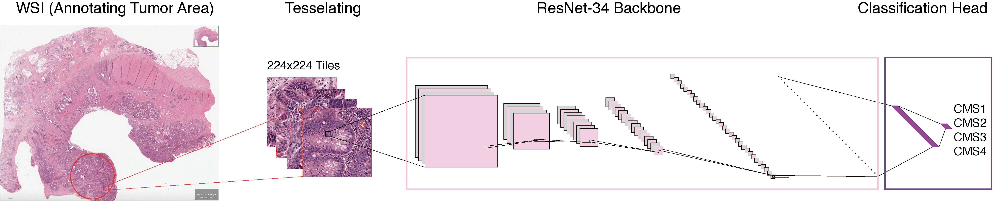

# Image-Based CMS Classification of Colorectal Cancer

This repository contains code and configs for our study:
**“Image-Based Consensus Molecular Subtype Classification of Colorectal Cancer using Deep Learning.”**

We train a ResNet-34 CNN on tumor tiles from TCGA COAD (colon adenocarcinoma) & READ (rectum adenocarcinoma) histopathology whole-slide images (WSIs) to predict colorectal cancer **CMS1–CMS4** subtypes. Labels are derived from coresponding RNA-seq data. The repo includes:
- Training & evaluation on COAD/READ (10-fold CV + held-out test)
- Tile-level inference + sample-level majority voting for unclassified cases
- whole-slide images preprocessing and transcriptomic CMS label generation


---

## Contents
- [Overview](#overview)
- [Data & Preprocessing](#data--preprocessing)
- [CMS Label Generation (RNA-seq)](#cms-label-generation-rna-seq)
- [Environment](#environment)
- [Training & Evaluation](#training--evaluation)
- [Repo Structure](#repo--structure)
- [License](#license)

---

## Overview

- **Backbone**: ResNet-34 (ImageNet-pretrained), first conv replaced with 5×5 (stride=2, pad=2)
- **Input**: tiles **224×224** randomly cropped from **512×512** tumor patches
- **Cohorts**: TCGA **COAD** and **READ**, trained **separately** with identical settings
- **Split**: **10-fold CV** on tiles + **10% held-out test**
- **Metrics**: Accuracy, Precision/Recall/F1, **ROC-AUC** (per-class, micro, macro), Confusion Matrix
- **Post-hoc**: Predict **unclassified** samples via tile-level thresholds + majority voting

---

## Data & Preprocessing

WSIs and RNA-seq come from **TCGA**.

- **WSI Source**: TCGA (GDC) https://portal.gdc.cancer.gov/
- **Tumor ROI annotation & tiling**:  
Tumor regions were manually annotated under pathologist supervision using **QuPath** scripting. Each whole-slide image was reviewed at low magnification to mark tumor areas while excluding artifacts. Annotated regions were then **tessellated into 512×512 px tiles** at **20× magnification** (0.5 µm/px) with 50 px overlap. The final curated tumor tiles were exported in **JPEG format** for downstream deep learning analysis.

**Preprocessing repo** (annotation + tiling scripts): (https://github.com/nedaghohabi/Histopathology-Image-Tiling

- The manually annotated and tiled histopathology images are publicaly availabel at Zenodo: https://zenodo.org/uploads/17266566 

---

## CMS Label Generation (RNA-seq)

Labels are derived using **CMSclassifier** on TCGA RNA-seq (FPKM-UQ), following the **RF + SSP consensus** approach.

CMS label generation repo/script: https://github.com/nedaghohabi/TCGA-RNA-seq 

We used:
- **TCGAbiolinks** to retrieve RNA-seq & clinical data
- **edgeR / limma** default normalization on FPKM-UQ
- **CMSclassifier** (RF posterior ≥ 0.5) and **SSP** after row-centering
- Final label retained only if **RF == SSP**; otherwise **unclassified**

---

## Environment

- **Python**: 3.9+
- **PyTorch**: 2.x (CUDA 11.8 recommended)
- **R** (CMSclassifier)
- **QuPath** 0.3.2 (annotations/tiling)
- See requirements.txt

## Training & Evaluation
The model was trained on manually annotated tumor tiles using a **ResNet-34** backbone pre-trained on **ImageNet**. Each whole-slide image was tessellated into **512×512 px tiles**, and randomly cropped to **224×224 px** during training. Training was performed using **10-fold stratified cross-validation**, with 10 % of the data held out for testing in each fold. The optimizer was **Adam** with AMSGrad enabled, and standard data augmentations were applied to improve generalization.

### Configuration Summary

#### Image & Tile Parameters  
- Image size = 224 px  
- Tile size = 512 px  
- Batch size = 16  
- Epochs = 5  

#### Model  
- Backbone = ResNet-34  
- Pre-trained on ImageNet  
- First convolution = 5×5 kernel  
- Number of classes = 4  

#### Optimizer  
- Type = Adam  
- Learning rate = 1 × 10⁻⁴  
- Weight decay = 5 × 10⁻⁴  
- AMSGrad = True  

#### Cross-Validation  
- Folds = 10  
- Test fraction = 0.10  
- Stratified = True  

#### Data Augmentation  
- Horizontal flip (p = 0.5)  
- Vertical flip (p = 0.5)  
- Rotation ± 45°  

## Repository Structure

```

crc_cms_classification/
├── exemplar_data    # All examplar data files
│   ├── example_read_tile
│       │   ├── CMS1/
│       │   ├── CMS2/
│       │   ├── CMS3/
│       │   └── CMS4/
│   ├── example_coad_tile
│       │   ├── CMS1/
│       │   ├── CMS2/
│       │   ├── CMS3/
│       │   └── CMS4/
├── models
├── src
│   ├──  training.py
│   ├──  inference.py
├── README.md
├── LICENSE
├── requirements.txt
```

## License

See MIT license